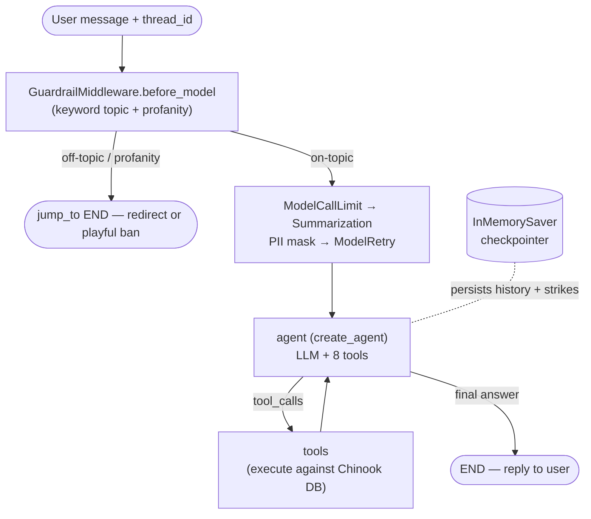

# Music Store Support Bot Demo

A lightweight demo showing how open-source LangChain and LangGraph components can be combined with LangSmith for a realistic customer-support experience in a music store.

**The story**: a music retailer wants a support bot that can answer two questions: what should I listen to next, and what have I bought before?

## What the bot can do

- **Music recommendations** based on a customer's prior purchases
- **Purchase-history and invoice lookups** for a given customer
- **Inventory snapshot** of the store's catalog
- **Artist search** by keyword or style
- **Genre catalog** summary of the store's music categories
- **Browse albums by genre** (e.g. Alternative & Punk), ranked by sales
- **Top-selling albums**, overall or within a genre

## Customer Identification

Personal data (purchase history, personal recommendations) is released **only on a verified
email match** — email is the one unique identifier. A name alone never unlocks an account:
names can collide (there are two "Luis" accounts), so the bot asks for the email rather than
listing candidate accounts to pick from. The Chinook database contains **59 customers** across
multiple countries.

### Test Accounts

Use any of these email addresses to test customer-specific features:

| Email | Name | Country |
|---|---|---|
| `luisg@embraer.com.br` | Luís Gonçalves | Brazil |
| `leonekohler@surfeu.de` | Leonie Köhler | Germany |
| `ftremblay@gmail.com` | François Tremblay | Canada |
| `bjorn.hansen@yahoo.no` | Bjørn Hansen | Norway |
| `frantisekw@jetbrains.com` | František Wichterlová | Czech Republic |
| `hholy@gmail.com` | Helena Holý | Austria |
| `astrid.gruber@apple.at` | Astrid Gruber | Austria |
| `daan_peeters@apple.be` | Daan Peeters | Belgium |
| `kara.nielsen@jubii.dk` | Kara Nielsen | Denmark |
| `eduardo@woodstock.com.br` | Eduardo Martins | Brazil |
| `alero@uol.com.br` | Alexandre Rocha | Brazil |
| `roberto.almeida@riotur.gov.br` | Roberto Almeida | Brazil |
| `fernadaramos4@uol.com.br` | Fernanda Ramos | Brazil |
| `mphilips12@shaw.ca` | Mark Philips | Canada |
| `jenniferp@rogers.ca` | Jennifer Peterson | Canada |
| `fharris@google.com` | Frank Harris | United States |
| `jacksmith@microsoft.com` | Jack Smith | United States |
| `michelleb@aol.com` | Michelle Brooks | United States |
| `tgoyer@apple.com` | Tim Goyer | United States |
| `dmiller@comcast.com` | Dan Miller | United States |
| `kachase@hotmail.com` | Kathy Chase | United States |
| `hleacock@gmail.com` | Heather Leacock | United States |
| `johngordon22@yahoo.com` | John Gordon | United States |
| `fralston@gmail.com` | Frank Ralston | United States |
| `vstevens@yahoo.com` | Victor Stevens | United States |
| `ricunningham@hotmail.com` | Richard Cunningham | United States |
| `patrick.gray@aol.com` | Patrick Gray | United States |
| `jubarnett@gmail.com` | Julia Barnett | United States |
| `robbrown@shaw.ca` | Robert Brown | Canada |
| `edfrancis@yachoo.ca` | Edward Francis | Canada |
| `marthasilk@gmail.com` | Martha Silk | United States |
| `aaronmitchell@yahoo.ca` | Aaron Mitchell | Canada |
| `ellie.sullivan@shaw.ca` | Ellie Sullivan | Canada |
| `jfernandes@yahoo.pt` | João Fernandes | Portugal |
| `masampaio@sapo.pt` | Madalena Sampaio | Portugal |
| `hannah.schneider@yahoo.de` | Hannah Schneider | Germany |
| `fzimmermann@yahoo.de` | Fynn Zimmermann | Germany |
| `nschroder@surfeu.de` | Niklas Schröder | Germany |
| `camille.bernard@yahoo.fr` | Camille Bernard | France |
| `dominiquelefebvre@gmail.com` | Dominique Lefebvre | France |
| `marc.dubois@hotmail.com` | Marc Dubois | France |
| `wyatt.girard@yahoo.fr` | Wyatt Girard | France |
| `isabelle_mercier@apple.fr` | Isabelle Mercier | France |
| `terhi.hamalainen@apple.fi` | Terhi Hämäläinen | Finland |
| `ladislav_kovacs@apple.hu` | Ladislav Kovács | Hungary |
| `hughoreilly@apple.ie` | Hugh O'Reilly | Ireland |
| `lucas.mancini@yahoo.it` | Lucas Mancini | Italy |
| `johavanderberg@yahoo.nl` | Johannes Van der Berg | Netherlands |
| `stanisław.wójcik@wp.pl` | Stanisław Wójcik | Poland |
| `enrique_munoz@yahoo.es` | Enrique Muñoz | Spain |
| `joakim.johansson@yahoo.se` | Joakim Johansson | Sweden |
| `emma_jones@hotmail.com` | Emma Jones | United Kingdom |
| `phil.hughes@gmail.com` | Phil Hughes | United Kingdom |
| `steve.murray@yahoo.uk` | Steve Murray | United Kingdom |
| `mark.taylor@yahoo.au` | Mark Taylor | Australia |
| `diego.gutierrez@yahoo.ar` | Diego Gutiérrez | Argentina |
| `luisrojas@yahoo.cl` | Luis Rojas | Chile |
| `manoj.pareek@rediff.com` | Manoj Pareek | India |
| `puja_srivastava@yahoo.in` | Puja Srivastava | India |

> **Note:** "John Gordon" (IDs 23 and 31) is the only name collision in the database — email lookups will always be unambiguous.

## Architecture

The agent is built with LangChain's **`create_agent`** — the prebuilt ReAct loop (agent ⇄
tools) — plus a **middleware stack** (one custom guardrail + four LangChain built-ins) and a
LangGraph **`InMemorySaver` checkpointer** that owns conversation state. A message first passes
the **guardrail** (`before_model`) that can short-circuit off-topic/profane input; on-topic
input reaches the LLM, and if it asks for a tool the loop runs it against the Chinook DB and
comes back until a final answer is produced. LangSmith traces every hop.



### Components

| Layer | Responsibility |
|---|---|
| **Agent** (`app.py`) | `create_agent(model, tools, system_prompt, middleware=[…], checkpointer=…)` — the prebuilt agent ⇄ tools ReAct loop; no hand-rolled `StateGraph` |
| **GuardrailMiddleware** (custom) | `before_model` hook: keyword topic classifier + 2-strike profanity easter egg; `jump_to="end"` before any LLM/tool call |
| **ModelCallLimitMiddleware** (built-in) | Caps the ReAct loop (`run_limit=8`, graceful `exit_behavior="end"`) so a turn can't spin forever |
| **SummarizationMiddleware** (built-in) | Condenses old history past a token budget (`trigger=("tokens", 8000)`, keeps recent 20) — idiomatic context management; rarely fires at this window |
| **PIIMiddleware** (built-in) | Masks `email` in the bot's **replies** (`apply_to_output`); **input is left intact** (`apply_to_input=False`) so email-required lookups still work |
| **ModelRetryMiddleware** (built-in) | Retries the model call with backoff; on final failure returns a friendly "endpoint down" message (replaces the old hand-rolled fallback) |
| **Checkpointer** (`InMemorySaver`) | Persists per-thread state (message history **and** `profanity_strikes`) in-process, keyed by `thread_id`; callers send only the new turn |
| **LangChain tools** (`support_bot.py`) | Eight `@tool` functions: purchase history, recommendations, inventory, artist lookup, genre catalog, genre browse, top sellers, store reference — each backed by Chinook SQL |
| **LLM** | Hosted **Claude** (`ChatAnthropic`) or any local OpenAI-compatible endpoint (`ChatOpenAI` → llama.cpp/Ollama), selected by `LLM_PROVIDER` / auto-detected from `ANTHROPIC_API_KEY` |
| **LangSmith** | Tracing/observability of the agent's decisions and tool calls (enabled by its own env vars) |
| **Chinook DB** | SQLite catalog (customers, invoices, tracks, genres); auto-downloaded on first run |

### Request lifecycle

1. **Guardrail** — `GuardrailMiddleware.before_model` classifies the latest message. Off-topic
   or profane input is answered with a canned reply and `jump_to="end"` — no LLM cost. Because
   `profanity_strikes` is persisted by the checkpointer, the 2nd strike bans the thread and the
   ban sticks across later messages until it's reset.
2. **Loop & context guards** — `ModelCallLimitMiddleware` bounds the ReAct loop; `Summarization‑
   Middleware` condenses history if it's grown past the token budget (usually a no-op).
3. **Agent ⇄ tools** — the LLM runs (the system prompt, carrying the email-only identification
   procedure, is supplied by `create_agent`); if it emits `tool_calls` the prebuilt loop
   executes them against the Chinook DB and returns until the LLM produces a plain answer.
   `ModelRetryMiddleware` wraps this call so a transient endpoint blip retries, and a hard
   failure yields a friendly message instead of a crash.
4. **PII & reply** — `PIIMiddleware` masks any email the model would echo back (input is never
   touched, so lookups keep working). LangSmith records each hop and tool call.

### Conversation state

State lives in the LangGraph checkpointer (`messages` + `profanity_strikes`), keyed by a
`thread_id` passed in the invoke config. The interactive runner sends only the **new** message
each turn — no client-side transcript — and LangGraph restores the rest, so follow-ups like
answering "what's your email?" a turn later just work. `/clear` starts a fresh `thread_id`
(blank history, strikes reset); `/quit` (or `/exit`) exits.

The full `database_context.md` schema is not baked into the system prompt — it's exposed as
`store_reference_tool`, which the LLM calls only when it needs schema detail, keeping ~650
tokens off every turn.

## Quick Start

```bash
# 1. Activate the shared environment
source ~/.virtualenvs/langchain/bin/activate

# 2. Install dependencies
pip install -r requirements.txt

# 3. Configure — copy the template and edit .env (all settings live there)
cp .env.example .env
# then set a backend in .env: ANTHROPIC_API_KEY=... (hosted Claude, zero setup)
# or LLM_ENDPOINT=... (local OpenAI-compatible server: llama.cpp/Ollama)

# 4. Run the demo
python demo.py --sample        # batch mode
python demo.py                 # interactive mode
```

The startup banner shows which backend and whether tracing is on, e.g.
`[backend: anthropic · model: claude-sonnet-5 · LangSmith: on]`.

## Run it as a server (LangGraph Platform)

`demo.py` is a CLI. To run the agent the way it runs in **production** — a streaming REST API
with persistent threads — serve the *same* graph with the LangGraph CLI. The graph is exposed
via [langgraph.json](langgraph.json) → `app.py:make_graph` (built **without** a checkpointer,
since the platform manages persistence).

**Dev server + Studio (no Docker):**

```bash
pip install "langgraph-cli[inmem]"
langgraph dev                 # → http://localhost:2024, opens LangGraph Studio (graph view)
```

**Production stack (Docker: server + Postgres + Redis):**

```bash
pip install "langgraph-cli"   # Docker must be running
langgraph up                  # → http://localhost:8123
```

Both read `.env`, so `LANGSMITH_API_KEY` and your model config are already set. Call the API:

```bash
curl -s http://localhost:2024/runs/wait -H "Content-Type: application/json" -d '{
  "assistant_id": "support_bot",
  "input": {"messages": [{"role": "user", "content": "top sellers in Jazz"}]}
}'
```

Notes:

- **Model connectivity** — the agent reaches your LLM via `LLM_ENDPOINT`. A LAN IP like
  `http://192.168.1.163:8033/v1` resolves from *inside* the container, so a Dockerized agent
  talks to the local model with low latency on the same box (no `host.docker.internal` needed).
- **Persistence** — under the server, threads/state live in Postgres (Docker) or in-memory
  (`langgraph dev`); that's why `make_graph()` omits the `InMemorySaver` the CLI demo uses.
- `langgraph dev` (and lightweight self-host) is free with a LangSmith key; a full production
  `langgraph up` self-host may require a LangGraph Platform license.

## Configuration

### Choosing the model backend

The agent runs on **hosted Claude** or a **local OpenAI-compatible endpoint**. If `LLM_PROVIDER`
is unset, it auto-detects: **Anthropic when `ANTHROPIC_API_KEY` is present, otherwise the local
endpoint**. The hosted path is the zero-setup way to run the demo — no local inference server
needed.

### Environment Variables

All configuration is read from the environment (loaded from `.env` via `python-dotenv`); see
[.env.example](.env.example) for a ready-to-copy template.

| Variable | Default | Description |
|---|---|---|
| `LLM_PROVIDER` | _(auto)_ | `anthropic` or `local`; unset auto-detects from `ANTHROPIC_API_KEY` |
| `ANTHROPIC_API_KEY` | _(none)_ | Enables the hosted-Claude backend |
| `ANTHROPIC_MODEL` | `claude-sonnet-5` | Default model for the Anthropic backend |
| `LLM_ENDPOINT` | `http://localhost:8000/v1` | Local OpenAI-compatible endpoint (llama.cpp/Ollama) |
| `LOCAL_MODEL` | `qwen3.6-35b-a3b` | Default model for the local backend |
| `LLM_MODEL` | _(per backend)_ | Explicit model override for the active backend; a non-`claude-*` value is ignored on the Anthropic path |
| `LLM_TEMPERATURE` | `0.3` | Sampling temperature (both backends) |
| `MAX_OUTPUT_TOKENS` | _(unset)_ | Hard cap on generated tokens; unset = backend default (local runs to EOS) |
| `OPENAI_API_KEY` | `sk-not-needed-for-local` | Dummy key required by the OpenAI client for local endpoints |
| `TRACE_ENABLED` | `0` (off) | Enable middleware logging (tool calls, timing) |
| `TRACE_RAW` | `0` (off) | When `TRACE_ENABLED=1`, log raw argument values instead of redacted ones |
| `LANGSMITH_TRACING` | _(unset)_ | LangSmith's own on/off switch — set to `true` to trace (see below) |
| `LANGSMITH_API_KEY` | _(none)_ | LangSmith API key; required for tracing |
| `LANGSMITH_PROJECT` | `musicstore-chatbot` | LangSmith project name |

### Console tracing

Middleware console logging is **disabled by default** to avoid leaking PII to stdout. Enable it with:

```bash
TRACE_ENABLED=1 python demo.py          # logs tool names + timing, redacts customer names
TRACE_ENABLED=1 TRACE_RAW=1 python demo.py  # logs full argument values (debugging only)
```

## LangSmith tracing

Tracing is driven entirely by LangSmith's **own** environment variables — the app adds no
wiring. Set them in `.env` (or the shell) and every agent turn is traced, no code changes:

```bash
LANGSMITH_TRACING=true
LANGSMITH_API_KEY=your-key
LANGSMITH_PROJECT=musicstore-chatbot   # optional; this is the default
```

Each turn appears as a named `musicstore-support` trace (tagged `musicstore-demo`) whose tree
shows the whole run: the **guardrail** decision, the **model** call, and every **tool**
invocation with its inputs/outputs and latency. It's the clearest way to see _why_ the agent
asked for an email, or which tool answered a catalog question. The startup banner reports
`LangSmith: on/off` (read straight from `LANGSMITH_TRACING`).

## Project Files

| File | Purpose |
|---|---|
| [app.py](app.py) | `create_agent` agent + guardrail/fallback middleware, `InMemorySaver` checkpointer, 8 tools, model-backend selection, system prompt |
| [support_bot.py](support_bot.py) | Chinook database queries and the tool implementations, email-only identity gate |
| [demo.py](demo.py) | Sample and interactive demo runners; per-thread conversation via the checkpointer |
| [database_context.md](database_context.md) | Schema and data insights, served on demand via `store_reference_tool` (not baked into every prompt) |
| [CLAUDE.md](CLAUDE.md) | Single agent-context file for AI tools (architecture, conventions, gotchas) |
| [.env](.env) | Model backend/keys, LangSmith credentials |

## More Details

- **Environment & commands**: see [MEMORY.md](MEMORY.md)
- **Current state & roadmap**: see [PROJECT_STATUS.md](PROJECT_STATUS.md)

## Resources

- **Interview / demo cheat sheet** — LangChain · LangGraph · Deep Agents · LangSmith, mapped to this repo: <https://claude.ai/code/artifact/e2ade25e-77f2-4c94-b32b-d9f98ba4427e>
- **Task brief** — Deployed Engineer Technical Task (LangChain & LangSmith Demo): <https://mirror-feeling-d80.notion.site/Deployed-Engineer-Technical-Task-LangChain-and-LangSmith-Demo-2fc808527b178012904dc568d97616d2>
- **LangChain built-in middleware** — <https://docs.langchain.com/oss/python/langchain/middleware/built-in>
- **Chinook dataset** — <https://github.com/lerocha/chinook-database>
